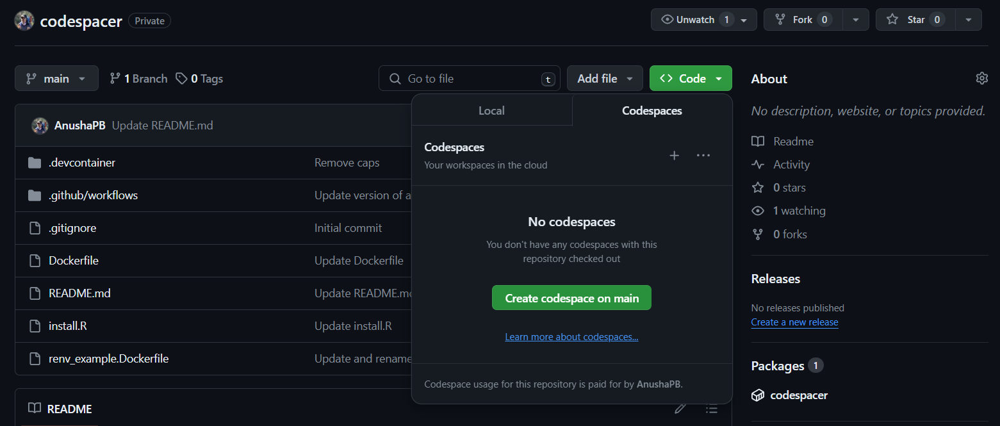

# Setting up GitHub codespaces for R

This repository provides an example workflow of how to setup a GitHub codespace for R. First, a Docker image with all the necessary dependencies is built using a GitHub Action and pushed to the GitHub Container Registry. Then, the image is used to build the codespace. Some additional setup is also done to make sure the RStudio session starts automatically and is in the correct project.

This repository can be forked and used as a template for setting up your own codespace for R. Only one change is required, and that is to change the [devcontainer.json](.devcontainer/devcontainer.json) file to point to your Docker image (i.e., change from ghcr.io/anushapb/codespacer:latest to ghcr.io/username/reponame:latest). No other changes are required, but you will likely also want to update the [install.R](install.R) file to include any additional R packages you want to install.

This repository uses code from: https://github.com/boettiger-lab/nasa-topst-env-justice

## 1. Building a Docker image

To build a Docker image for the codespace, we use a [Dockerfile](Dockerfile) that sets up a Docker image with the necessary dependencies for running R. The Docker image is built using a GitHub Action and pushed to the GitHub Container Registry. 

**Docker basics:**  Imagine you bought a brand new Lenovo laptop, installed an Ubuntu operating system on it, installed R and RStudio, installed all of the packages you needed and then gave it to your friend. Docker is like doing that but it's a virtual computer than you can share with as many people as you want and set-up however you want it.
The main Docker terms to know are:
1. **Dockerfile** - text file of instructions for creating the docker image (specifies what operating system, what software, etc.). The Docker file is used to build the Docker image.
2. **Docker image** - package that contains everything we specified in the Dockerfile needed to run the code. The Docker image is used to create a Docker container.
3. **Docker container** - the actual thing that runs and you interact with (like a virtual machine/computer).

For more information about Docker: https://docs.docker.com/get-started/overview/

**GitHub action basics:** We could build the Docker image on our own computer, but that would mean everytime we changed anything about our image we would have to bother to do it again. Instead, we can just have GitHub do it! In general, GitHub Actions are a way to automate tasks in your repository.

For more information about GitHub Actions: https://docs.github.com/en/actions

### 1.1 The Dockerfile

First, we write a Dockerfile that will set-up a Docker image that contains the necessary dependencies for running R in a codespace. 

This image is built off the tidyverse v 4.3.1 Dev Container image from the [rocker project](https://rocker-project.org/). This should work fine for most users. You may want to switch to another Dev Container image depending on your requirements (other options can be found [here](https://rocker-project.org/images/devcontainer/images.html)). For example for working with geospatial packages you may want to use the geospatial rocker image (ghcr.io/rocker-org/devcontainer/geospatial:4.3).

The [Dockerfile](Dockerfile) is as follows:

```Dockerfile
# Start with the tidyverse v 4.3.1 image from rocker
FROM ghcr.io/rocker-org/devcontainer/tidyverse:4.3
# You can use other rocker images: https://rocker-project.org/images/devcontainer/images.html
# For example for working with geospatial packages:
#FROM ghcr.io/rocker-org/devcontainer/geospatial:4.3

# Relabel docker (otherwise it will have the rocker description)
LABEL org.opencontainers.image.description=""

# Install any additional desired packages (edit the install.R script to add packages)
COPY install.R install.R
RUN Rscript install.R && rm install.R
```

To add R dependencies to the image, edit the [install.R](install.R) file with any packages you want to install, like this:

```r
#! /usr/local/bin/Rscript
# Install R dependencies

# Add lines here for installing packages:
install.packages("wingen")
remotes::install_github('AnushaPB/wingen')
```

### 1.2 Building the Docker image

We will use a GitHub Action to automatically build our Docker image and push it to the GitHub container registry whenever changes are made to the specified files. The GitHub Action is setup using the [docker-image.yml](.github/workflows/docker-image.yml) file in the [.github/workflows](.github/workflows) folder. The Docker image name will be the same as your repository name (note: if there are any uppercase letters in your username or repo name, they will be converted to lower case).:

```yaml
name: docker-build
on:
  push:
    # Optional: specify paths for files that should trigger the action if changed 
    # In this case, the action is triggered when the Dockerfile or install.R are changed
    paths:
      - Dockerfile
      - .github/workflows/docker-image.yml
      - install.R
    branches: [ "main" ]
    # Publish semver tags as releases.
    tags: [ 'v*.*.*' ]

jobs:
  build:
    runs-on: ubuntu-latest
    permissions: write-all
    steps:
      - uses: actions/checkout@v4
      - name: Login to GitHub Container Registry
        uses: docker/login-action@v3
        with:
          registry: ghcr.io
          username: ${{github.actor}}
          password: ${{secrets.GITHUB_TOKEN}}
      - name: Build the Docker image
        # note: if there are any uppercase letters in your username or repo name, they will be converted to lower case
        run: docker build . --file Dockerfile --tag ghcr.io/${GITHUB_REPOSITORY,,}:latest
      - name: Publish
        run: docker push ghcr.io/${GITHUB_REPOSITORY,,}:latest
```

Anytime you change the Dockerfile, docker-image.yml, or install.R files, the Docker image will be built and pushed to the GitHub container registry **automatically!**

You can see my image here (note how the name is the same as my repo name, but lowercase): [ghcr.io/anushapb/codespacer](https://github.com/AnushaPB/codespacer/pkgs/container/codespacer)

## 2. Setting up a devcontainer

We can now use the Docker image we've built as the base our codespace. We use three files to setup the codespace, all located in the [.devcontainer](.devcontainer/) folder.  The main file is the [devcontainer.json](.devcontainer/devcontainer.json) file. The other two files ([setup.sh](.devcontainer/setup.sh) and [welcome.sh](.devcontainer/welcome.sh)) are used to configure the RStudio session in the codespace. Without these extra files the Rstudio session will not start automatically and the session will not start within the repository's `.RProject`, however all of these things can technically be done manually within the codespace, if you don't want to use these files.

File overview:

1. [devcontainer.json](.devcontainer/devcontainer.json) - a json file which specifies how to setup the container (i.e., the Docker image to use, the extensions to install, and the settings for the codespace). **In this file change the Docker image path from ghcr.io/anushapb/codespacer:latest to your image (i.e., ghcr.io/username/reponame:latest).**

1. [setup.sh](.devcontainer/setup.sh) - a shell script that runs when the codespace is created to setup the Rstudio session.

2. [welcome.sh](.devcontainer/welcome.sh) - a shell script that runs when the codespace is attached to setup the R project and welcome the user with a link to open Rstudio.

## 3. Running the codespace

Start the codespace by clicking on the green "Code" button on the repository page and selecting create codespace. The codespace will then start. 



To open the RStudio session in the codespace follow the link in the welcome message or go to "ports" and open the 8787 port.
